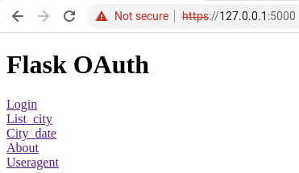
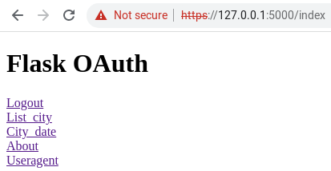
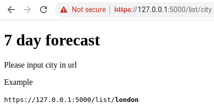
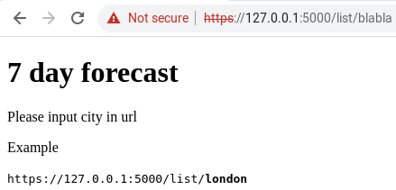
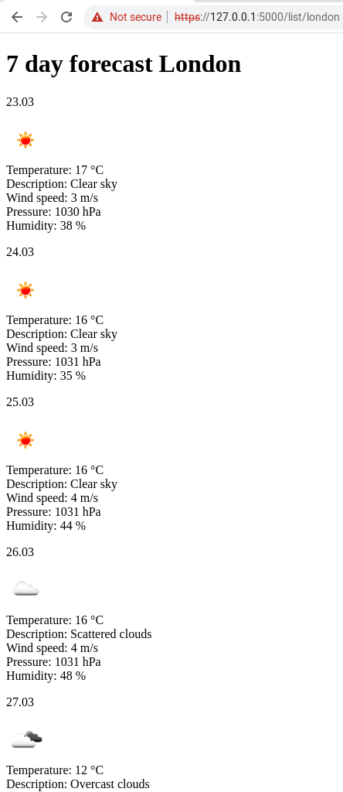
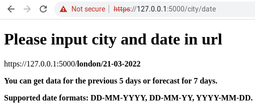
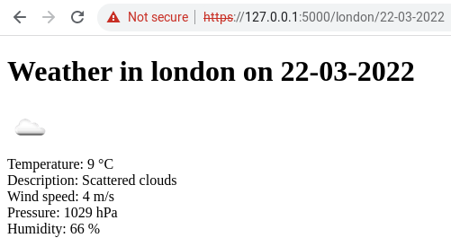
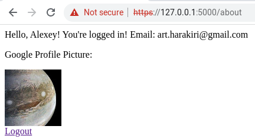
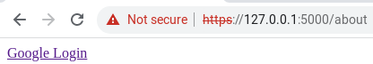
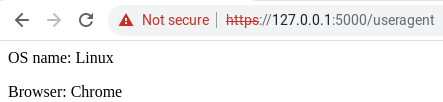

# Flask OAuth

## Quick start

Clone the repository and copy .env.example file.

```console
$ cp .env.example .env
```

Don't forget to provide credentials in .env.

Create virtual environment and install dependencies.

```console
$ virtualenv env

$ source env/bin/activate

$ pip install -r requirements
```

Start application.

```console
$ python app.py
```

## Endpoints

start



index not logged in



index logged in


list/city



list/blabla (oops, wrong city)



list/london



city/date



london/22-03-2022



about logged in



about not logged in



useragent

